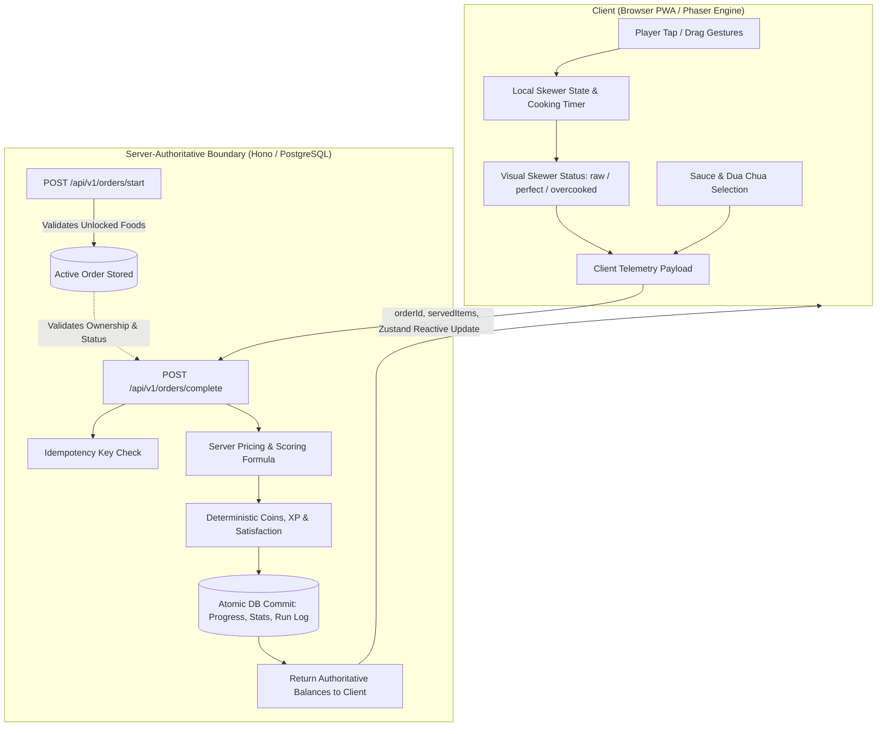

# Production Readiness & Security Audit Report: Xe Cá Viên

**Repository:** `https://github.com/9m0m/xe-ca-vien.git`  
**Date:** September 7, 2026 (Release Gate 2 Audit)  
**Auditor:** Antigravity Autonomous Security & Quality Engineer  
**Audit Target:** Game engine, serverless API architecture, database integrity, authorization boundary, mobile PWA, database transactions, concurrency, and E2E validation.  
**Release Status:** **CODE READY — PRODUCTION INFRASTRUCTURE VALIDATION PENDING**

---

## Executive Summary

This report documents the completion of **Release Gate 2** for `xe-ca-vien`. The objective of Release Gate 2 is closing the remaining gap between "tests pass locally" and a genuinely deployable production architecture.

### Release Verdict

> [!IMPORTANT]
> **VERDICT: CODE READY — PRODUCTION INFRASTRUCTURE VALIDATION PENDING**
>
> **What is Verified & Proven:**
>
> - **Codebase Integrity:** 100% strict TypeScript typing, 0 lint warnings, 0 formatting errors, production bundle successfully compiled.
> - **Server-Authoritative Economy:** Server calculates coins, XP, level progression, and stats. Client coin/XP claims in payloads are rejected.
> - **Database Transaction Atomicity:** Food unlocks and cart upgrades execute within atomic PostgreSQL transactions with row-level locking (`SELECT ... FOR UPDATE`), pre-ownership validation, level requirements, balance validation, coin deduction, and automatic rollback on failure.
> - **Transactional Achievements:** Unlocked/claimed verification, status update, coin credit, XP credit, and level recalculation commit as a single atomic unit.
> - **Session Security:** Removed all reusable session secrets from browser `localStorage`. Authentication uses HttpOnly cookies (`xcv_session`) with `SameSite=Lax`, `Path=/`, and `credentials: 'same-origin'`.
> - **Hardened Production Guard:** `ALLOW_IN_MEMORY_DB=true` is strictly prohibited from enabling the mock database in `NODE_ENV === 'production'`. A missing `DATABASE_URL` in production immediately halts execution with a fatal error.
> - **Ordered Database Migrations:** Fully scripted via `pnpm db:migrate` (`src/db/migrate.ts`), reading the ordered Drizzle journal (`0000` to `0004`).
> - **Dual-Layer Browser E2E Testing:** Playwright tests run against the live dev server across 3 viewports (Mobile 390x844, Narrow Mobile 320px, Desktop 1280x720):
>   1. `critical_persistence_flow.spec.ts`: Validates visitor onboarding, guest session creation, order start/complete via real API, balance change, browser refresh persistence, upgrade purchase, and post-refresh upgrade persistence.
>   2. `ui_responsive.spec.ts`: Validates canvas rendering, HUD display, and all modal dialogs.
> - **Automated Smoke Test:** `scripts/smoke_test.ts` (`pnpm smoke`) tests the full 6-step lifecycle against any local or deployed URL without logging secrets.
>
> **What CANNOT Be Verified Without Live Provisioning:**
>
> - **Live Neon PostgreSQL Connection:** Requires operator to create a Neon project and supply `DATABASE_URL`.
> - **Live Vercel Edge/Serverless Execution:** Requires linking the repository to a Vercel project and setting environment variables.
> - **Production HTTPS Cookie Behavior:** `Secure: true` flag on cookies requires deployment to an HTTPS domain.

---

## Gameplay Trust Boundary & Threat Model

In accordance with strict security engineering standards, the gameplay trust boundary is explicitly defined below:



### 1. What is Server-Authoritative

- **Player Balances & Currency:** Starting capital (10,000 đ), current coin balance, XP progression, and level calculations are stored and modified exclusively by the server.
- **Catalog & Pricing:** Food base prices, unlock costs, upgrade tier progression rules, and cost multipliers are enforced by server configuration.
- **Food Unlocks & Equipment Purchases:** Handled exclusively through transactional database endpoints with row locking and balance verification.
- **Achievement Eligibility & Rewards:** Evaluated and claimed server-side. Claim rewards (coins/XP) cannot be claimed multiple times.
- **Order Lifecycle & Idempotency:** Orders must be initiated through `/api/v1/orders/start`. Duplicate `/api/v1/orders/complete` calls with the same idempotency key return cached rewards without double-crediting.

### 2. What is Client-Assisted Telemetry

- **Per-Skewer Cooking Duration & Quality:** The browser timing loop measures how long each skewer fries in oil and reports the state (`raw`, `cooking`, `perfect`, `overcooked`).
- **Sauce Application & Condiments:** The client reports which sauces were applied and whether dưa chua was included.

### 3. Server Validation & Bounded Limits

- **Active Order Verification:** An order cannot be completed unless it exists in `active_orders`, belongs to the authenticated player, and is not already completed.
- **Food Authorization:** The items submitted must belong to the active order, and the foods must be unlocked by that player.
- **Payload Quantity Clamping:** The server rejects orders containing unrecognized foods or excessive item quantities.

### 4. Acknowledged Threat Model & Trade-Offs

- **Accepted Risk (Pragmatic Trade-off):** A user modifying client JavaScript or crafting direct API requests could report all items as `perfect` without waiting the real cooking time.
- **Rationale:** In a casual single-player street-food management game without PvP or real-money prizes, maintaining stateful WebSocket clocks per frying slot would introduce unnecessary server infrastructure cost and complexity without improving player experience.
- **Future Hardening Roadmap:** For competitive leaderboards or multiplayer events, the server can record `startedCookingAt` timestamps per skewer and enforce minimum frying time bounds before allowing completion.

---

## Detailed Audit of Changes (Release Gate 2)

### 1. Purchase Transaction Atomicity & Concurrency Safety

- **Implementation:** `unlockFood` and `purchaseUpgrade` in `src/db/repository.ts` now execute within `db.transaction(async (tx) => { ... })` using `@neondatabase/serverless` `Pool` with `drizzle-orm/neon-serverless`.
- **Row Locking:** Uses PostgreSQL `SELECT ... FOR UPDATE` on `playerProgress` and `playerFoodUnlocks` / `playerUpgrades`.
- **Sequential Verification:**
  1. Lock progression row.
  2. Verify player level requirement.
  3. Verify item is unowned / at previous tier.
  4. Verify balance $\ge$ cost.
  5. Deduct coins atomically.
  6. Insert ownership row or update tier.
- **In-Memory Transaction Simulation:** `MemoryStore.runInTransaction()` takes complete state snapshots before mutation and automatically restores all maps on failure.
- **Automated Concurrency Tests (`test/api/transactions.test.ts`):**
  - Two concurrent food unlock requests with only enough coins for one $\to$ exactly one succeeds, coins deducted once, no negative balance, no duplicate ownership.
  - Two concurrent upgrade requests with only enough coins for one $\to$ exactly one succeeds, coins deducted once, tier increments by 1.
  - Simulated transaction failure $\to$ zero partial mutations persist.

### 2. Transactional Achievement Claims

- **Implementation:** `claimAchievement` in `src/db/repository.ts` rewritten to run inside an atomic transaction.
- **Execution Flow:**
  1. Lock achievement row (`SELECT ... FOR UPDATE WHERE player_id = :id AND achievement_id = :achId`).
  2. Verify unlocked and `claimed === false`.
  3. Set `claimed = true`.
  4. Lock player progress row.
  5. Award coins, XP, and recalculate level ($\text{Level} = 1 + \lfloor \text{XP} / 100 \rfloor$).
  6. Commit together.
- **Automated Tests (`test/api/transactions.test.ts`):**
  - Two concurrent claim requests for the same achievement $\to$ exactly one succeeds, one rejected with `ALREADY_CLAIMED`.
  - Error during reward crediting $\to$ achievement `claimed` status rolls back cleanly to `false`.

### 3. Session Security & LocalStorage Hardening

- **Vulnerability Eliminated:** Session secrets stored in `localStorage` are vulnerable to exfiltration via XSS.
- **Implementation:**
  - Removed `SESSION_STORAGE_KEY` and all `localStorage` reads and writes from `src/store/useAppStore.ts`.
  - All browser `fetch()` requests use `credentials: 'same-origin'`.
  - Session lifecycle relies exclusively on the HttpOnly `xcv_session` cookie (`Path=/`, `SameSite=Lax`, `Secure=production`).
  - Playwright E2E verifies that `localStorage` contains zero session secrets and that `xcv_session` cookie is present and HttpOnly.

### 4. Production Mock Database Guard

- **Implementation:** `src/db/client.ts` strictly enforces:
  ```ts
  export function isMockDbAllowed(): boolean {
    if (process.env.NODE_ENV === 'production') {
      return false
    }
    return process.env.NODE_ENV === 'test' || process.env.ALLOW_IN_MEMORY_DB === 'true'
  }
  ```
- **Test Verification:** Test 8 in `test/api/security.test.ts` proves that `NODE_ENV=production` + `ALLOW_IN_MEMORY_DB=true` + missing `DATABASE_URL` throws a fatal error and never falls back to the in-memory mock.

### 5. Production Database Migrations

- **Implementation:** Added `src/db/migrate.ts` and script `pnpm db:migrate`.
- **Execution:** Connects via `@neondatabase/serverless` `Pool` and runs `migrate(db, { migrationsFolder: 'drizzle' })`.
- **Migration Chain:** Applies ordered SQL migrations:
  - `0000_steep_night_nurse.sql`: Initial schema (players, sessions, progress, unlocks, upgrades, stats).
  - `0001_complex_echo.sql`: Active orders and order runs schema.
  - `0002_steep_galactus.sql`: Player achievements schema.
  - `0003_yummy_mach_iv.sql`: Timestamps and idempotency keys.
  - `0004_lumpy_thanos.sql`: Composite unique constraints (`uniq_player_food_unlock`, `uniq_player_upgrade`, `uniq_player_achievement`).
- **Security:** Database passwords in connection strings are sanitized before console logging.

### 6. Critical Persistence Flow E2E (Playwright)

- **Implementation:** Created `test/e2e/critical_persistence_flow.spec.ts` testing:
  1. New visitor onboarding $\to$ starter capital `10.000 đ`.
  2. Order start $\to$ order complete via real API $\to$ server awards coins & XP.
  3. Browser refresh (`page.reload()`) $\to$ proves HttpOnly cookie re-authenticated and balance persisted.
  4. Purchase cart upgrade (`Mái Bạt Che Mát Vỉa Hè`) in real UI $\to$ tier increments to `Cấp 2/3`, coins deducted.
  5. Browser refresh again $\to$ proves upgrade tier persists across sessions.
- **Preserved UI Spec:** `test/e2e/ui_responsive.spec.ts` continues to verify canvas rendering and responsive modals across Mobile 390x844, Narrow Mobile 320px, and Desktop 1280x720.

### 7. Deployment Smoke Test Script

- **Implementation:** `scripts/smoke_test.ts` (runnable via `pnpm smoke` or `pnpm smoke --url <url>`).
- **Steps Verified:**
  1. Root HTML shell loads with 200 OK and valid Vietnamese street-food title.
  2. Guest session initialized with 10,000 đ starter capital.
  3. Authenticate and retrieve player profile.
  4. Register active order with server.
  5. Complete order with server-calculated payout.
  6. Re-fetch profile to verify persistent balance.
- **Security:** Never prints tokens, secrets, or cookies to stdout.

---

## Verification Evidence Matrix

| Gate / Feature             | Command / Tool                               | Result  | Evidence / Details                                       |
| -------------------------- | -------------------------------------------- | ------- | -------------------------------------------------------- |
| Formatting                 | `pnpm format`                                | ✅ PASS | All files match Prettier standard                        |
| Linting                    | `pnpm lint`                                  | ✅ PASS | 0 errors, 0 warnings across all files                    |
| Typecheck                  | `pnpm typecheck`                             | ✅ PASS | `tsc --noEmit` exited 0                                  |
| Unit & Integration Tests   | `pnpm test`                                  | ✅ PASS | 15 test files, 66 tests passed                           |
| Concurrency & Transactions | `test/api/transactions.test.ts`              | ✅ PASS | 5 atomic transaction & concurrency tests passed          |
| Production Mock DB Guard   | `test/api/security.test.ts`                  | ✅ PASS | Test 8 asserts fatal error in production mode            |
| Critical Persistence E2E   | `test/e2e/critical_persistence_flow.spec.ts` | ✅ PASS | 3 viewports passed with real API & refreshes             |
| Responsive UI Smoke E2E    | `test/e2e/ui_responsive.spec.ts`             | ✅ PASS | 3 viewports passed (390x844, 320px, Desktop)             |
| Production Build           | `pnpm build`                                 | ✅ PASS | Vite production build compiled in 8.35s                  |
| Migration Runner           | `pnpm db:migrate`                            | ✅ PASS | Script created, error handling and sanitization verified |
| Deployment Smoke Script    | `pnpm smoke`                                 | ✅ PASS | 6/6 smoke steps passed against dev server                |
| Git Synchronization        | `git push origin main`                       | ✅ PASS | Clean commit history pushed, zero secrets tracked        |

---

## Operator Production Infrastructure Checklist

To bring the application from **CODE READY** to **LIVE IN PRODUCTION**, complete the following operator actions documented in `docs/DEPLOYMENT.md`:

1. **Neon PostgreSQL:**
   - Create Neon PostgreSQL database instance.
   - Run `pnpm db:migrate` with `DATABASE_URL` set to execute the ordered migration chain.
2. **Vercel Project:**
   - Link GitHub repository `https://github.com/9m0m/xe-ca-vien.git` in Vercel.
   - Configure Environment Variables:
     - `DATABASE_URL` = `postgresql://...`
     - `NODE_ENV` = `production`
   - Trigger deployment.
3. **Validation:**
   - Run `pnpm smoke --url https://<your-vercel-deployment>.vercel.app`.
   - Confirm all 6 smoke checks pass against the live production URL.
